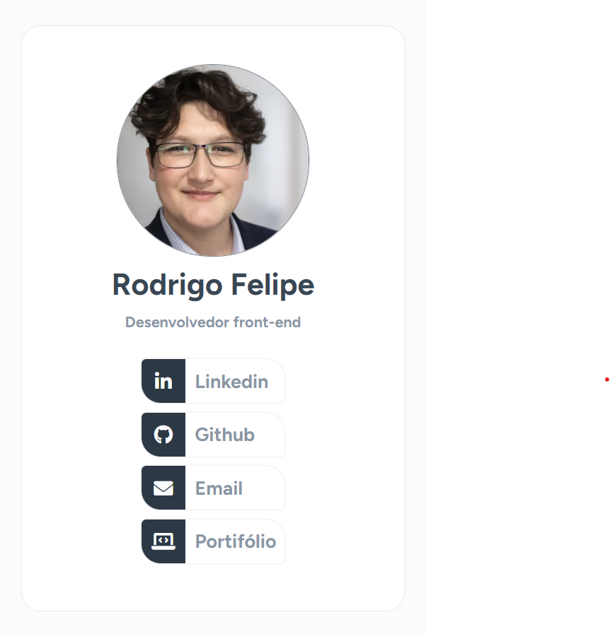

# 🔗 Linkfolio

Uma página simples de **link-in-bio** desenvolvida com HTML e CSS puro, com foco em boas práticas, organização de código e design limpo.

## 📸 Preview

## 🚀 Sobre o projeto

O **Linkfolio** é uma página de perfil que centraliza links importantes, como redes sociais e portfólio, em um único lugar — ideal para uso em bios de redes sociais.

Este projeto foi desenvolvido como parte de um treino prático de HTML e CSS, com o objetivo de evoluir na construção de layouts e aplicação de boas práticas.

## 🛠️ Tecnologias utilizadas

- HTML5
- CSS3

## 🎯 Objetivos do projeto

- Praticar estruturação semântica com HTML
- Trabalhar layout com Flexbox
- Aplicar estilização moderna com CSS
- Criar uma interface limpa e responsiva
- Melhorar organização e legibilidade do código

## 📱 Funcionalidades

- Exibição de perfil (foto, nome e descrição)
- Lista de links clicáveis
- Layout centralizado
- Design minimalista
- Responsividade básica

## 📂 Estrutura do projeto

linkfolio/
│── index.html
│── style.css
│── assets/
│ └── images/

## 💡 Aprendizados

Durante o desenvolvimento deste projeto, foram praticados:

- Organização de classes CSS
- Alinhamento e espaçamento
- Uso de ícones em botões
- Estruturação visual de componentes reutilizáveis

## 🌐 Deploy

O projeto está disponível online:

👉 https://linkfolio-rodrigo.vercel.app

## 📌 Autor

Desenvolvido por **Rodrigo Felipe**

- LinkedIn: (https://www.linkedin.com/in/rodrigo-felipe-1b4992233/)

---

## 🧠 Observação

Este projeto faz parte de uma rotina de prática diária com o objetivo de evoluir no desenvolvimento front-end e construir um portfólio sólido.